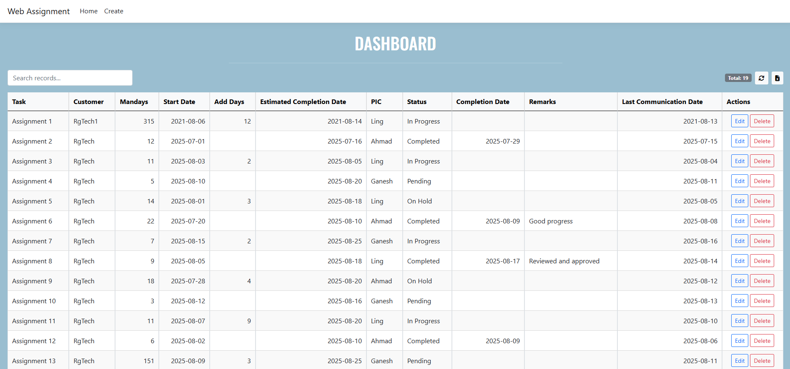
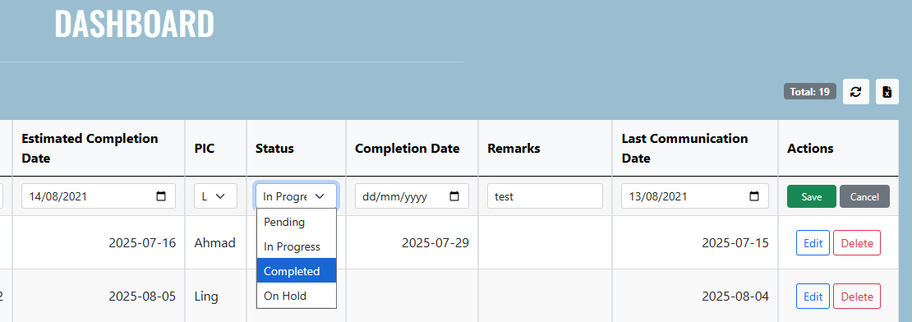
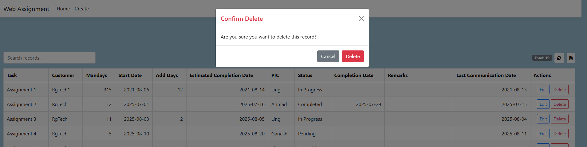
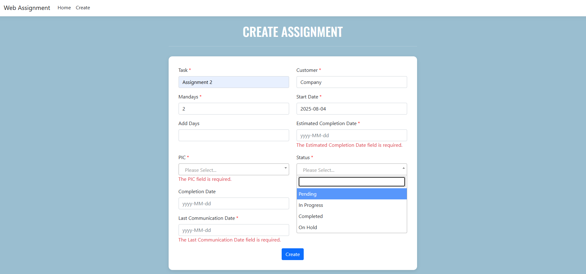

# Overview

A simple web-based system that provides full CRUD functionality to manage assignment details

# Features
1. Dashboard
   - View a table of all assignments
   - Search assignments using a search box
   - Export assignment list to Excel
   - Edit existing assignment details
   - Delete assignment records

2. Create Assignment
   - Add new assignment entries to the database

# Platform
- Developed using ASP.NET Core MVC, C#, and Bootstrap.
- Database used for this development is SQL Server.

# Snippets of this project

<table border="1">
  <tr>
    <td>Dashboard</td>
    <td colspan="3">
      
      
      
    </td>
  </tr>
  <tr>
    <td>Create Assignment</td>
    <td colspan="3">
      
    </td>
  </tr>
</table>
